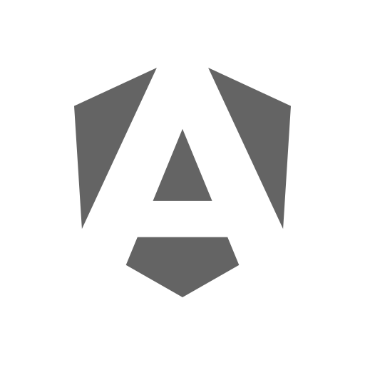

<div align="center">
  <p></p>
  <h1><code>SUPERDOC</code></h1>
</div>

<table>
  <tbody><tr><td align="center" width="99999"><div>
    <a href="https://olankens.com">WEBSITE</a> ·
    <a href="https://ko-fi.com/olankens">FUNDING</a>
  </div></td></tr></tbody>
  <tbody><tr><td align="center" width="99999">&nbsp;<div>
    Personal notes, references, and technical docs on coding, tools, data structures, algorithms, system design, and engineering practices for fast retrieval, active learning, and reliable skill development.
  </div>&nbsp;</td></tr></tbody>
  <tbody><tr><td align="center" width="99999">
    <a href="https://wikipedia.org/wiki/Bash_(Unix_shell)"></a>
    <picture></picture>
    <a href="https://wikipedia.org/wiki/Markdown"></a>
  </td></tr></tbody>
</table>

## PREVIEWS

<table><tbody><tr><td width="99999">
  
</td></tr></tbody></table>

## FEATURES

<!-- START_TABLE -->
<table>
  <tbody><tr>
    <td align="center" width="99999"><a href="source/android"></a></td>
    <td align="center" width="99999"><a href="source/angular"></a></td>
    <td align="center" width="99999"><a href="source/astro"></a></td>
    <td align="center" width="99999"><a href="source/flutter"></a></td>
  </tr></tbody>
  <tbody><tr>
    <td align="center" width="99999"><a href="source/hisenseu7nq"></a></td>
    <td align="center" width="99999"><a href="source/hisenseu7qf"></a></td>
    <td align="center" width="99999"><a href="source/intellijidea"></a></td>
    <td align="center" width="99999"><a href="source/kodi"></a></td>
  </tr></tbody>
  <tbody><tr>
    <td align="center" width="99999"><a href="source/masterduel"></a></td>
    <td align="center" width="99999"><a href="source/nodedotjs"></a></td>
    <td align="center" width="99999"><a href="source/nvidiashield"></a></td>
    <td align="center" width="99999"><a href="source/python"></a></td>
  </tr></tbody>
  <tbody><tr>
    <td align="center" width="99999"><a href="source/shell"></a></td>
    <td align="center" width="99999"><a href="source/spring"></a></td>
    <td align="center" width="99999"><a href="source/windows"></a></td>
  </tr></tbody>
</table>
<!-- CEASE_TABLE -->

## LEARNING

### CREATE NEW DOCUMENTATION

```sh
​
​
​
​
```
